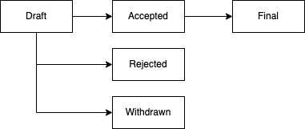

<pre>
  UIP: 1
  Title: UIP Purpose and Guidelines
  Author: Igor Stojanov <igor.stojanov@universaldot.foundation>
  Comments-Summary: No comments yet.
  Comments-URI: https://github.com/bitcoin/bips/wiki/Comments:BIP-0001
  Status: Accepted
  Type: Process
  Created: 2023-02-15
  Superseded-By: 0
</pre>

## UIP workflow

New proposals are issued through a pull request in this repository. The proposals have to be submitted in markdown (.md) format.

Once the proposal is submitted via pull request, the proposal draft will be accepted or rejected. Upon acceptance, the proposal becomes final. 

The process is outlined in the following diagram.

## UIP template

UIP closely follows the bitcoin improvement proposal standard (BIP).

Every new proposal starts with a preamble as shown bellow.

<pre>
  UIP: 1
  Title: UIP Purpose and Guidelines
  Author: Igor Stojanov <igor.stojanov@universaldot.foundation>
  Comments-Summary: No comments yet.
  Comments-URI: https://github.com/bitcoin/bips/wiki/Comments:BIP-0001
  Status: Accepted
  Type: Process
  Created: 2023-02-15
  Superseded-By: 0
</pre>

## History

This document was derived heavily from BIP-0001 which was derived from Python's PEP-0001. 

## Changelog